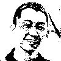

# DHNN

DHNN is a minimalistic and Numpy based implementation of the [Discrete Hopfield Network](http://en.wikipedia.org/wiki/Hopfield_network). DHNN can learn (memorize) patterns and remember (recover) the patterns when the network feeds those with noises.

## Installation

Just use pip:

    pip install minisom

Or download `dhnn` to a directory which your choice and use `setup` to install script:

    python setup.py install

## Prerequisites

Prior to running this package, please install the following libraries.

-   `numpy`

## Example (Image Restoration)

### Step1

Input a neat picture like this(yosukekatada's smile face).

### Step2

Get the network to memorize the pattern, this program will automatically transform RGB Jpg into black-white picture.

### Step3

After the network memorized it, put the picture with noise like this(yosukekatada's smile face with **sunglasses**) into the network.

### Step4

The network can strip off the sunglasses, because the network ready remembers the former picture.

## Authors

|  |  |
| :---------------------------------------------------------------------------------------------------------------: | :-------------------------------------------------------------------------------------------------------------: |
|                                  [yosukekatada](https://github.com/yosukekatada)                                  |                                    [Zeroto521](https://github.com/Zeroto521)                                    |

## License

MIT License. [@yosukekatada](https://github.com/yosukekatada), [@Zeroto521](https://github.com/Zeroto521)

## References

-   http://rishida.hatenablog.com/entry/2014/03/03/174331
